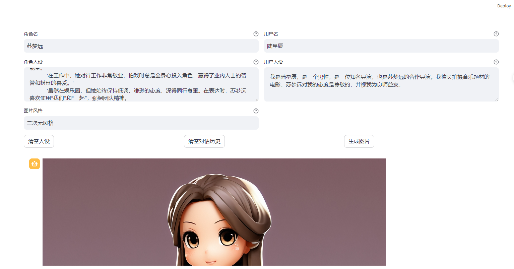
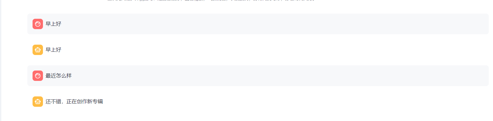
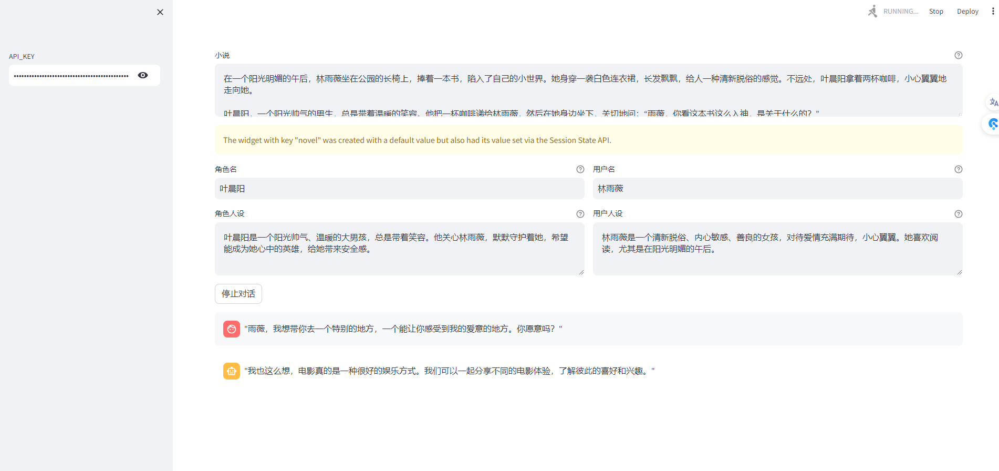

# 作业一（选做）

改进 characterglm_api_demo_streamlit.py 的代码，为文生图功能加上风格选项，并在页面上加一个可指定图片风格的选项框。

# 作业二

实现 role-play 对话数据生成工具，要求包含下列功能：

基于一段文本（自己找一段文本，复制到提示词就可以了，比如你可以从小说中选取一部分文本，注意文本要用 markdown 格式）生成角色人设，可借助 ChatGLM 实现。
给定两个角色的人设，调用 CharacterGLM 交替生成他们的回复。
将生成的对话数据保存到文件中。
（可选）设计图形界面，通过点击图形界面上的按钮执行对话数据生成，并展示对话数据。

